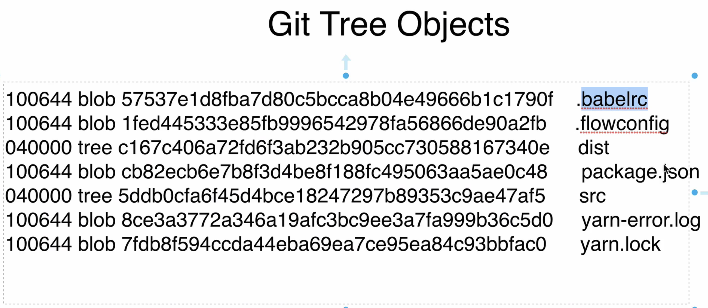
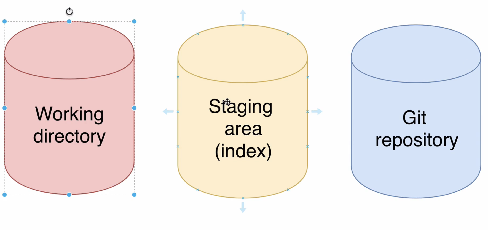

## Git

### How Git works under the hood

##### Initialize new Git repository: `git init`

- 어디에서 입력? Where you want to create a new repository
- 숨겨진 .git 폴더가 생성됨

#####  Overview of .git folder

- In it's file system, git store objects

##### Git objs types

- Blob, Tree, Commit, Annotated Tag
- tracking
- Blob: Git blob (binary large object) is the object type used to store the contents of each file in a repository
- Tree: **A Git tree object creates the hierarchy between files in a Git repository**. You can use the Git tree object to create the relationship between directories and the files they contain
- Commit: commit object that has a pointer to its tree object. The commit object contains – ***tree object hash, parent commit hash, author, committer, date, and message***
- `git hash-object`
- `git cat-file`

##### Writing new Git object with `git hash-object`

~~~bash
echo "Hello, Git" | git hash-object --stdin -w
# output: a5c19667710254f835085b99726e523457150e03
~~~

.git/objects/ 

위치에 폴더가 생성되며, 이 폴더 내의 파일 명("c19667710254f835085b99726e523457150e03")과 폴더명("a5")을 합치면 Hash와 동일하다

##### JSON vs Git database

JSON

~~~json
// JSON stands for javascript obj notation
// JSON format is used for data exchange between different servers
{
    "id": "1234567",
    "name": "Mike",
    "age": 25,
    "city": "New York",
    "hobbies": ["Skateboarding", "Running"]
}
~~~

- Git database is also set of key-value pair
- but key in git is generated based on value

##### What is hash function

- One-way, 일방향만 가능하다.
- 높은 보안성, 신뢰성을 보장하므로 패스워드 등이 database에 저장될 때 hash로 저장된다.

- Same hash function will always create <u>same hash</u> for the <u>same input</u>

##### Hash function overview

- 대표함수들의 예시

- Hash generator라는 사이트도 있다. 직접 작성해볼 수 있음
- Git utilize SHA1 hash function, Hexadecimal format으로 나타낸 160bit

##### SHA1 Hash Function

- 160bits, 40 hexadecimal characters
- Even small change of input data will lead to creation of completly different hash

- Let's generate hash using command line interface using iterm

~~~bash
man shasum # shasum: To print or check SHA Checksums

# echo command automatically add line break.
# line break 없이 print 하려면 -n option
echo -n "Hello, Git"

echo "Hello, Git" | shasum
# 40개의 hexadecimal chars

echo -n "Hello, Git" | shasum
# 위와 다를 것이다. line break 만으로도 해쉬가 이렇게나 다르다
~~~

- Folder name + File name = File SHA1 hash

- How many different files could be stored in a single Git repo?

##### How many files Git can store in the same repo

- The answer is 2 ** 160(= 1,461....), Git은 SHA1 function을 사용하며, 160bits
- 하나의 hash가 생성될 때 가능한 조합 

##### What is the chance of producing same hash for differeent files(Collinsion)?

- The answer is, 0.0...04

- 동일한 hash가 생성(collision)될 확률은 매우 낮다.

참고

##### Exploring Git objs with `git cat-file` command

~~~bash
# contents of obj1
git cat-file -p b7aec520dec0a7516c18eb4c68b64ae1eb9b5a5e # Hello, Git

# type of obj
git cat-file -t b7aec520dec0a7516c18eb4c68b64ae1eb9b5a5e # blob

# size of obj
git cat-file -s b7aec520dec0a7516c18eb4c68b64ae1eb9b5a5e # 11

~~~

~~~bash
git cat-file -p b7aec520dec0a7516c18eb4c68b64ae1eb9b5a5a # Error

# because no file
~~~

##### Create new Git Blob based on the file

~~~bash
echo "Hello, Git" | git hash-object --stdin -w

# 위의 방법 말고, git obj를 생성하는 다른 방식, 소스파일을 사용한다
git hash-object <filename> -w
~~~

~~~bash
# pwd: Desktop
echo "Second file in Git repository" > new-file.txt

# Desktop/first-project
git hash-object ../new-file.txt -w

# obj 생성됐다!

git cat-file -p 4400aae52a27341314f423095846b1f215a7cf08 # Second file in Git repository
git cat-file -t 4400aae52a27341314f423095846b1f215a7cf08 # blob
git cat-file -s 4400aae52a27341314f423095846b1f215a7cf08 # 30
~~~

##### Git blobs don't store filenames

##### Where size and type of each obj are stored in Git?

shamsum과 hash-obj 둘 다 sha1 을 사용하지만 해쉬가 다른 것을 확인할 수 있다.

그 이유는 hash-obj는  git obj 그 자체에 사이즈와 타입을 포함하기 때문

<u>Git generates SHA1 hash based on the input + type + size</u>

##### Contents of Git objects

~~~bash
# type, size, contents를 함께 넣어줌으로써
# shasum과 hash-obj 같은 hash 얻게 된다.
echo -e "blob 30\0Second file in Git repository" | shasum # 4400aae52a27341314f423095846b1f215a7cf08

~~~

##### Tree objs in Git

- blob은 file  name을 저장할 수 없다. 그렇다면..

- Filenames for the blobs are stored in trees
- Permission/ type/ hash/ filename or dir_name

##### Git obj permissions

##### Creating Git Tree obj

~~~bash
# pwd: first-project
find .git/objects -type f
# .git/objects/44/00aae52a27341314f423095846b1f215a7cf08
# .git/objects/b7/aec520dec0a7516c18eb4c68b64ae1eb9b5a5e

git mktree --help
# pwd: Desktop
vim temp-tree.txt 

## In vim
# 100644 blob b7aec520dec0a7516c18eb4c68b64ae1eb9b5a5e	file1.txt # using tab
# 100644 blob 4400aae52a27341314f423095846b1f215a7cf08	file2.txt

# pwd: first-project
cat ../temp-tree.txt | git mktree
# SHA1 hash of the new tree Git obj
# Output: 3b95df0ac6365c72e9b0ff6c449645c87e6e1159

find .git/objects -type f
# .git/objects/3b/95df0ac6365c72e9b0ff6c449645c87e6e1159
# .git/objects/44/00aae52a27341314f423095846b1f215a7cf08
# .git/objects/b7/aec520dec0a7516c18eb4c68b64ae1eb9b5a5e
~~~

##### Examining Tree Obj

~~~bash
# hash 5글자로도 식별이 된다.

git cat-file -p 3b95d
# 100644 blob b7aec520dec0a7516c18eb4c68b64ae1eb9b5a5e	file1.txt
# 100644 blob 4400aae52a27341314f423095846b1f215a7cf08	file2.txt
git cat-file -t 3b95d # tree
git cat-file -p 3b95d # 74
~~~

##### Working directory Staging area and Git repo, Overview of current files distribution

- git repo: blob. tree 등이 저장됨
- working directory: .git folder가 저장된 그 위치(폴더). 현재는 empty
- staging area: `git ls-files -s` : List files in the staging area. 현재는 empty

##### Git read-tree

~~~bash
find .git/objects -type -f
# .git/objects/3b/95df0ac6365c72e9b0ff6c449645c87e6e1159
# .git/objects/44/00aae52a27341314f423095846b1f215a7cf08
# .git/objects/b7/aec520dec0a7516c18eb4c68b64ae1eb9b5a5e

git cat-file -t 3b95 # tree

git read-tree 3b95 # staging area로 보냄
~~~

##### Read files in the staging area using git ls-files

~~~bash
# We can read the contents of staging area using 'git ls-files'
git ls-files

git ls-files -s # '0'의 의미: git repo와 동일한 file이다
~~~

##### Git checkout-index

~~~bash
git checkout-index -a

ls -l
# -rw-r--r--  1 isntsoo  staff  11 Jul 25 18:13 file1.txt
# -rw-r--r--  1 isntsoo  staff  30 Jul 25 18:13 file2.txt

# Working directory에도 파일들이 생성됐다!
~~~

~~~bash
git status

Changes to be committed:
  (use "git rm --cached <file>..." to unstage)
	new file:   file1.txt
	new file:   file2.txt
~~~

##### How many folders could be created for objs

- hash 40 개 중 첫 두 글자가 폴더명의 역할을 한다. 이 두 문자는 각각 16진수의 문자이다.
- 따라서 .git/objects/ 안에는 최대 256개의 폴더가 존재할 수 있다.

