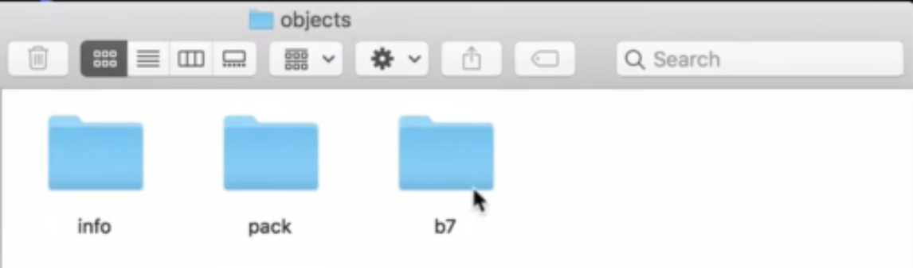
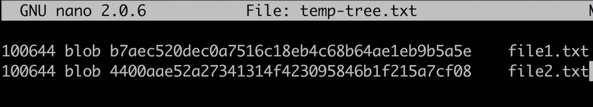

## Git

##### Difference between git and github

### How Git works under the hood

##### Initialize new Git repository: `git init`

- 어디에서 입력? Where you want to create a new repository
- 숨겨진 폴더(`.git`) 생성됨

---

#####  Overview of .git folder

- In it's file system, git store objs in objects folder.

---

##### Git objs types

- Blob(), Tree, Commit, Annotated Tag
  - Blob(store files): Git blob (binary large object) is the object type used to store the contents of each file in a repository
  - Tree(store directories): A Git tree object creates the hierarchy between files in a Git repository**. You can use the Git tree object to create the relationship between directories and the files they contain
  - Commit: commit object that has a pointer to its tree object. The commit object contains – ***tree object hash, parent commit hash, author, committer, date, and message***
  - Annotated tag is persistent text pointer to a specific commit

- git low-level commands
  - `git hash-object`: we will be able to create new obj(default: blob type) in git structure
  - `git mktree`: to create new tree obj
  - `git cat-file`: we will be able to read git objs

##### Writing new Git object with `git hash-object`

~~~bash
echo "Hello, Git" | git hash-object --stdin -w # -w option 추가
# output: b7aec5...
~~~

`.git/objects/`

위치에 폴더가 생성되며, 이 폴더 내의 file name("`aec520...`")과 folder name("`b7`")을 합치면 Hash(`b7aec520...`)와 동일하다

---

##### JSON vs Git database

JSON - specification에 따르면, JSON의 key는 unique하게 설정하길 권고함.

~~~json
// JSON stands for javascript obj notation
// JSON format is used for data exchange between different servers
{
    "id": "1234567",
    "name": "Mike",
    "age": 25,
    "city": "New York",
    "hobbies": ["Skateboarding", "Running"]
}
~~~

- Git database is also set of key-value pair
- but key in git is generated based on value

---

##### What is hash function

##### 

- hash functions are “one-way” function. 일방향만 가능하다. hash만을 가지고 input을 알아낼 수 없다.
- 높은 보안성, 신뢰성을 보장하므로 패스워드 등이 database에 저장될 때 hash로 저장된다.
  - user가 로그인을 위해 비밀번호를 입력하면, 서버는 이것의 해쉬를 생성하고, db에 미리 저장되어 있는 해쉬와 비교.
- Same hash function will always create <u>same hash</u> for the <u>same input</u>
  - Hash is generated based on the contents of the file
- hash의 length는 fixed.

---

##### Hash function overview

- 대표함수들의 예시

- Hash generator라는 사이트에서 직접 gernerate 해볼 수 있다.

  

---

##### SHA1 Hash Function

- Git utilize SHA1 hash function, Hexadecimal format으로 나타낸 160bit
- It is 160bits, 40 hexadecimal characters

- Even small change of input data(exclamation mark) will lead to creation of completly different hash

- Let's generate hash using command line interface using iterm 

~~~bash
man shasum # shasum: To print or check SHA Checksums

# echo command automatically add line break.
# line break 없이 print 하려면 -n option
echo -n "Hello, Git"

echo "Hello, Git" | shasum
# 40개의 hexadecimal chars

echo -n "Hello, Git" | shasum
# 위와 다를 것이다. line break 만으로도 해쉬가 이렇게나 다르다.
~~~

- Folder name + File name = File SHA1 hash

- How many different files could be stored in a single Git repo? 다음 내용...

   

---

##### How many files Git can store in the same repo?

- The answer is 2 ** 160(= 1,461....)이다. Git은 `SHA1 function`을 사용하며, 이는 160bits이기 때문이다.
- 하나의 hash가 생성될 때 가능한 조합이 이렇게나 많다...

---

##### What is the chance of producing same hash for differeent files(What is the probabilityu of hash Collinsion)?

- The answer is, (1/(10 ** 96)) * 4

- 동일한 hash가 생성(collision)될 확률은 매우 낮다.

참고

---

##### Exploring Git objs with `git cat-file` command

- to read contents of any obj in git repository independent of its type.

~~~bash
# contents of obj1
git cat-file -p b7aec5... # Hello, Git

# type of obj
git cat-file -t b7aec5... # blob

# size of obj
git cat-file -s b7aec5... # 11

~~~

~~~bash
# because there is no file(obj) in git repository
git cat-file -p b7aec5... # Error
~~~

---

##### Create new Git Blob based on the file

~~~bash
# echo "Hello, Git" | git hash-object --stdin -w
# 위의 방법 말고, git obj를 생성하는 다른 방식, 직접적으로 소스파일을 사용한다
git hash-object <src_filename> -w
~~~

~~~bash
# pwd: Desktop.
# create src_file
echo "Second file in Git repository" > new-file.txt

# pwd: Desktop/first-project 
# create obj, # -w option to write new obj to repository
git hash-object ../new-file.txt -w # 4400aa...

# obj 생성됐다!
~~~

~~~bash

# pwd: first-project
git cat-file -p 4400aa... # Second file in Git repository
git cat-file -t 4400aa... # blob
git cat-file -s 4400aa... # 30
~~~

---

#####  Why Git doesn’t require filename for the file that you add to the Git database?

- Git blobs don't have filenames

---

##### Where size and type of each obj are stored in Git?

shamsum과 hash-obj 둘 다 sha1 을 사용하지만 hash가 다른 것을 확인할 수 있다.

그 이유는 hash-obj는  git obj 그 자체에 사이즈와 타입을 포함하기 때문

<u>Git generates SHA1 hash based on the input + type + size</u>

---

##### Contents of Git objects(format of objs in git repo)

- Obj type and obj length are stored inside of the blob

~~~bash
# type, size, contents를 함께 넣어줌으로써
# shasum도 hash-obj와 같은 hash 얻게 된다.
echo -e "blob 30\0Second file in Git repository" | shasum 
# 4400aa...

# cf> hash-object
# echo "Second file in Git repository" > new-file.txt
# git hash-object ../new-file.txt -w 
# 4400aa...
~~~

##### Tree objs in Git

- Filenames for the blobs are stored in trees.
- Tree reporesents directories and may contain blobs and other trees.
- 아래 사진은 실제 tree objs의 예시이다. permission/ type/ sha1 hash/ name(of f or d)

- blob은 file  name을 저장할 수 없다. 그렇다면..

- Filenames for the blobs are stored in trees
- Permission/ type/ hash/ filename or dir_name

---

##### Git obj permissions

---

##### Creating Git Tree obj

~~~bash
# pwd: first-project
find .git/objects -type f

git mktree --help
# pwd: Desktop
vim temp-tree.txt 

## In vim
# 100644 blob b7aec520dec0a7516c18eb4c68b64ae1eb9b5a5e	file1.txt # using tab
# 100644 blob 4400aae52a27341314f423095846b1f215a7cf08	file2.txt

# pwd: first-project
cat ../temp-tree.txt | git mktree
# SHA1 hash of the new tree Git obj
# Output: 3b95df0ac6365c72e9b0ff6c449645c87e6e1159 # It is SHA1 hash of the new tree git obj

find .git/objects -type f
# .git/objects/3b/95df0ac6365c72e9b0ff6c449645c87e6e1159
# .git/objects/44/00aae52a27341314f423095846b1f215a7cf08
# .git/objects/b7/aec520dec0a7516c18eb4c68b64ae1eb9b5a5e
~~~

---

##### Examining Tree Obj

~~~bash
# hash 5글자로도 식별이 된다.
git cat-file -p 3b95d
# 100644 blob b7aec520dec0a7516c18eb4c68b64ae1eb9b5a5e	file1.txt
# 100644 blob 4400aae52a27341314f423095846b1f215a7cf08	file2.txt

git cat-file -t 3b95d # tree
git cat-file -s 3b95d # 74
~~~

f

---

##### Working directory Staging area and Git repo, Overview of current files distribution

- git repo: blob. tree 등이 저장됨. 지금까지 확인한 곳. `.git`
- staging area(index): `git ls-files -s` : List files in the staging area. 현재는 empty
- working directory: .git folder가 저장된 그 위치(폴더). 현재는 empty. ex> `first-project`

---

##### Git read-tree

~~~bash
find .git/objects -type -f
# .git/objects/3b/95df0ac6365c72e9b0ff6c449645c87e6e1159
# .git/objects/44/00aae52a27341314f423095846b1f215a7cf08
# .git/objects/b7/aec520dec0a7516c18eb4c68b64ae1eb9b5a5e

git cat-file -t 3b95 # tree

git read-tree 3b95 # staging area로 보냄
~~~

##### Read files in the staging area using git ls-files

~~~bash
# We can read the contents of staging area using 'git ls-files'
git ls-files

git ls-files -s # '0'의 의미: git repo와 동일한 file이다
~~~

##### Git checkout-index

~~~bash
git checkout-index -a

ls -l
# -rw-r--r--  1 isntsoo  staff  11 Jul 25 18:13 file1.txt
# -rw-r--r--  1 isntsoo  staff  30 Jul 25 18:13 file2.txt

# Working directory에도 파일들이 생성됐다!
~~~

~~~bash
git status

Changes to be committed:
  (use "git rm --cached <file>..." to unstage)
	new file:   file1.txt
	new file:   file2.txt
~~~

##### How many folders could be created for objs

- hash 40 개 중 첫 두 글자가 폴더명의 역할을 한다. 이 두 문자는 각각 16진수의 문자이다.
- 따라서 .git/objects/ 안에는 최대 256개의 폴더가 존재할 수 있다.

