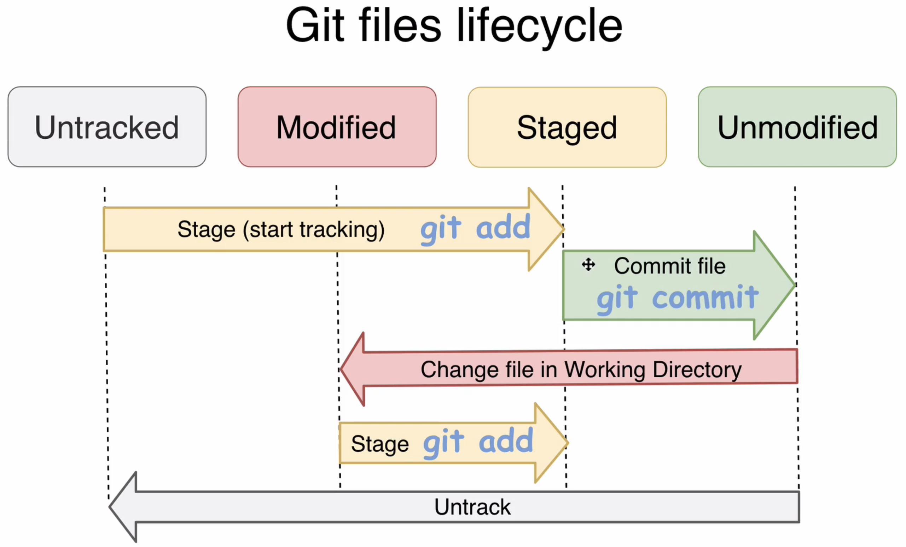

##### what is commit

- Commit includes Author name, description (and parent), and pointer.
- Commit is just "wrapper" for the tree obj and contains pointer to specific tree
- By moving to different commits(checking out) you are able to "travel" between different "versions" of the project

##### Configure Git author name and email

~~~ bash
# Set git author name and email
git config --global user.name "dev090613"
git config --global user.email "128305501+dev090613@users.noreply.github.com"

git config --list

# user.name=dev090613
# user.email=128305501+dev090613@users.noreply.github.com
~~~

- It's recommended to set in your local git config name and email same as used at GitHub account.

##### Creating first commit

~~~bash
git status
# Changes to be committed:
# ...

git ls-files -s
# 100644 b7aec520dec0a7516c18eb4c68b64ae1eb9b5a5e 0	file1.txt
# 100644 4400aae52a27341314f423095846b1f215a7cf08 0	file2.txt

git commit -m "Our very first commit in the project"
# [main (root-commit) 36e4080] Our very first commit in the project

# 새로운 SHA1 hash( 36e4080 )가 생성되어 .git/objects/ 에 저장되었다. 이 hash-obj는 commit이며 tree의 포인터를 포함한 여러가지 정보를 담는다.
# working directory에 저장된 files를 기반으로 git repo에 새로운 obj를 저장한 셈
~~~

##### Exploring commit object

~~~bash
git cat-file -p 36e4080

tree 3b95df0ac6365c72e9b0ff6c449645c87e6e1159 # Pointer of tree obj
author dev090613 <128305501+dev090613@users.noreply.github.com> 1690285932 +0900 # Author name and email
committer dev090613 <128305501+dev090613@users.noreply.github.com> 1690285932 +0900 # Committer

Our very first commit in the project # Description
~~~

##### Current project state overview

~~~bash
# 세 가지 커맨드 비교

ls -l # Working directory
git ls-files -s # Staging area(index)
find .git/objects/ -type f # git repo
~~~

##### Basic Git commands

~~~bash
git status # current state of git repo
git add # Add files from working directory to staging area
git commit # Write changes to git repo
git log # History of changes(commits)
git checkout # Checkout commit or branch
~~~

##### Adding new file to working directory

~~~bash
git log

commit 36e40801f4371df86146bb5b12de8da4e5d040ce (HEAD -> main)
Author: dev090613 <128305501+dev090613@users.noreply.github.com>
Date:   Tue Jul 25 20:52:12 2023 +0900

    Our very first commit in the project
~~~

~~~bash
echo -e "This is third file in our Git repository" > file3.txt

# file3.txt is absent now in the staging area
git ls-files -s
# 100644 b7aec520dec0a7516c18eb4c68b64ae1eb9b5a5e 0	file1.txt
# 100644 4400aae52a27341314f423095846b1f215a7cf08 0	file2.txt

git status 
# Untracked files:

~~~

- Every file in Git may have one of 4 tracking statuses:
  - Untracked
  - Modified
  - Staged
  - Unmodified

##### Git files lifecycle

- To Tracking file, Type `git add`

##### Stage file

~~~bash
# 방법 1: 전부 staging
git add . # dot is argument

# 방법 2: 특정 File staging
git add file3.txt
~~~

~~~bash
git ls-files -s

100644 b7aec520dec0a7516c18eb4c68b64ae1eb9b5a5e 0	file1.txt
100644 4400aae52a27341314f423095846b1f215a7cf08 0	file2.txt
100644 289960fd4f172ef29a9bf30f9c49c1725ca253dc 0	file3.txt

# file3.txt 가 staging area에 추가됐음을 확인할 수 있다.
~~~

##### Unstage file using git rm

~~~bash
git status

Changes to be committed:
  (use "git restore --staged <file>..." to unstage)
	new file:   file3.txt	
# file3.txt가 staging area에 위치하고 있음

# To unstage specific file
git rm --cached file3.txt # output: rm 'file3.txt'

git ls-files -s
# 100644 b7aec520dec0a7516c18eb4c68b64ae1eb9b5a5e 0	file1.txt
# 100644 4400aae52a27341314f423095846b1f215a7cf08 0	file2.txt

git status
# Untracked files: file3.txt

git add file3.txt
~~~

##### Commit changes

- `git commit` : files을 staged state에서 unmodified state로 옮긴다.
  - It will create new commit obj, create new blob obj for file3.txt and create new tree obj

~~~bash
git commit -m "Second commit"

[main a09ece8] Second commit
 1 file changed, 1 insertion(+)
 create mode 100644 file3.txt
 
# 이로 인해 file3.txt에 대한 hash-object가 git repo에 생성되었을 것이다. (working directory의 file을 기반으로 git repo에 obj를 생성한 것)
# file1.txt와 file2.txt에 관한 것은 이전에 이미 생성되었다. low-level로 직접 작성. (git repo에 직접 생성하였었고, git read-tree, checkout-index 하여 working directory에 가져왔었음 )
~~~

##### Exploring changes in Git repository

~~~bash
git status # nothing to commit, working tree clean

git log
# Part of hash in second commit: a09ec

git cat-file -p a09ec

tree 31b1e96ca47eb9a6c2a506d8a1d6530da7786ea7
parent 36e40801f4371df86146bb5b12de8da4e5d040ce # Pointer to parent commit
author dev090613 <128305501+dev090613@users.noreply.github.com> 1690297384 +0900
committer dev090613 <128305501+dev090613@users.noreply.github.com> 1690297384 +0900

Second commit
~~~

~~~bash
# parent commit 을 확인해보자. 이는 root commit이다.
git cat-file -p 36e40

tree 3b95df0ac6365c72e9b0ff6c449645c87e6e1159
author dev090613 <128305501+dev090613@users.noreply.github.com> 1690285932 +0900
committer dev090613 <128305501+dev090613@users.noreply.github.com> 1690285932 +0900

Our very first commit in the project
~~~

~~~bash
# 두 번째 커밋의 tree를 확인
git cat-file -p 31b1e

100644 blob b7aec520dec0a7516c18eb4c68b64ae1eb9b5a5e	file1.txt
100644 blob 4400aae52a27341314f423095846b1f215a7cf08	file2.txt
# git commit을 하여 working directory에 존재하던 file3.txt에 대한 obj가 git repo에 생성되었다.
100644 blob 289960fd4f172ef29a9bf30f9c49c1725ca253dc	file3.txt  

~~~

##### Current diagram of Git repository

- 현재 repo에 7개의 Obj 존재
- 두 tree는 각각 폴더의 상태를 contents로 삼는 것 같다(후자는 세 blobs에 대한 Links를 가지고 있음). 따라서 둘의 hash는 다르다.(fil3.txt의 존재 유무 차이가 있음)

