#### Most common Git operations

---

#### Overview of the current project state

- commit은 일종의 save point(snap shot)를 만드는 것
- 어떻게 다른 체크포인트로 이동할 수 있을까(다른 커밋 지점으로)

---

#### Installing GitHub Desktop

- GitHub is hosting service for your repositories
- Web 에서 GitHub desktop 을 다운받을 수 있으며(GUI), remote repo와 시각적으로 용이하게 interaction할 수 있어 이해에 도움이 된다.

---

#### What is branch in Git

- **Branch is just <u>text reference</u> to the commit**(branch는 특정 커밋을 가리키고 있음, default branch is called `main`)

- Pointers for all branches are located in `.git/refs/heads`

  
- Current branch tracks new commits.
- Branch pointer moves automatically after every new commit.
- Change branch `git checkout <branch>`.

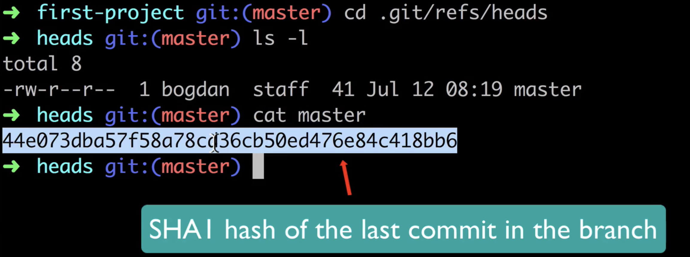

---

#### What is HEAD  in Git

- 하나의 repo에 여러 개의 branch를 생성할 수 있고 이들이 각각 커밋을 할 수 있지만, working directory에는 오직 하나의 version만 존재할 수 있다.

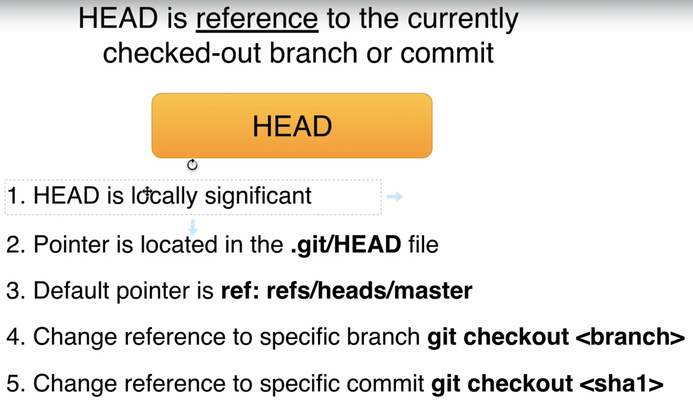

- How git know which branch is current branch?
  - HEAD를 사용해서 가르킨다. 헤드는 오직 하나만 존재.
    - HEAD is reference to the currently checked-out branch or commit
    - Pointer is located in the **.git/HEAD** file
    
    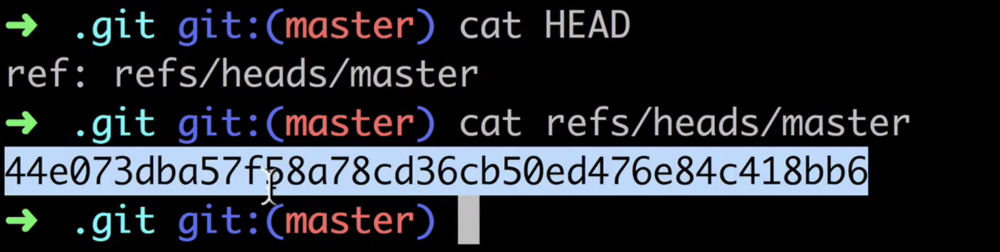
    
    - Default pointer is ref: **refs/heads/main**
    - HEAD가 가르키는 것을 바꿀 수 있다.
      - Change reference to specific branch `git checkout <branh>`
      - Change reference to specific commit `git checkout <sha1>`

---

#### Third commit

~~~bash
#pwd: first-project
ls -l
rm file1.txt file2.txt file3.txt

git status # Changes not staged for commit: ..

git add . 

git status # Changes to be committed: ..

git commit "Third commit"

[main 9f5b45d] Third commit
 3 files changed, 3 deletions(-)
 delete mode 100644 file1.txt
 delete mode 100644 file2.txt
 delete mode 100644 file3.txt
~~~

---

#### Git repository changes after third commit

- HEAD는 main(master)를 가리키고 있다.

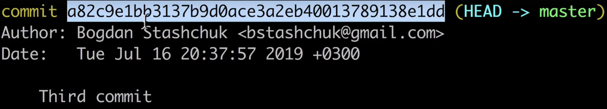

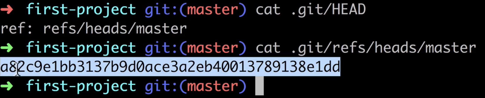

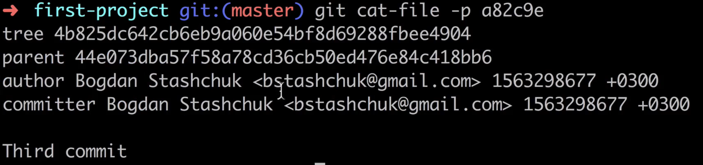

~~~bash
# pwd: first-project

cat .git/HEAD # ref: refs/heads/main
# HEAD가 가리키고 있는 branch 확인, main branch이다.

cat .git/refs/heads/main # 9f5b4
# 그리고 그 branch는 다음 commit을 가르키고 있다.

git cat-file -p 9f5b4
# tree 4b825
# parent a09ec
# tree와 parent commit을 가르키고 있다.

git cat-file -p 4b825
# empty, 아무 것도 출력되지 않는다.
# 이전 과정에서 working directory의 files를 전부 삭제하였기 때문에 tree는 어떠한 blobs도 가르키고 있지 않는다.

git ls-files -s # staging area도 비어있다.

# 하지만 .git 깃 레포로 들어가면, blobs hash로 이루어진 folders와 files가 남아있다.
# git didn't delete any of the previously created files or folders in the git repo. git stores entire history.
# 따라서 이전 체크포인트로 되돌릴 수 있는 것이다.
~~~

- HEAD는 하나만 존재 가능, branch는 여러 개 존재 가능

---

#### Checkout specific commit

- Pointer is located in `.git/HEAD` file. Default pointer is `refs/heads/main`. head를 이동시켜보자.

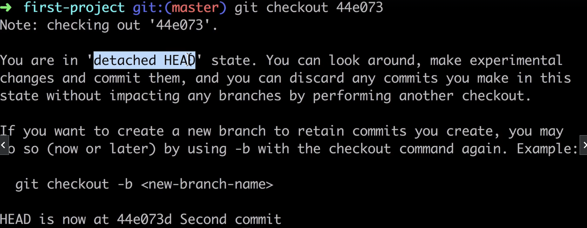

~~~bash	
cat .git/HEAD # refs/heads/main
# 현재 HEAD는 main branch를 가리키고 있다.

# HEAD가 가리키는 main branch의 hash 확인
cat .git/refs/heads/main # 9f5b45

# main branch의 commit 확인
git cat-file -p 9f5b4
# tree 4b825
# parent a09ec

# parent commit 확인
cat-file -p a09ec
# tree 31b1e
# parent 36e40

# HEAD가 parent commit을 가리키도록 하자
git checkout 36e40
# You are in 'detached HEAD' state.
# HEAD가 특정 branch가 아닌 commit 자체를 가리키게 됐다(detached HEAD 상태)

# 둘이 가르키는 곳이 달라졌다.
cat .git/HEAD # 36e40
cat .git/refs/heads/main # 9f5b4

ls -l # working directory의 상태가 바뀌었다(file1, file2 존재)
git ls-files -s # staging area의 상태도 바뀌었다(file1, file2 존재)

git checkout main # 다시 HEAD를 main으로 이동
~~~

---

#### Why do we need branches

- Branch is just text reference to the commit

- Branch is wrapper for commit

- Every branch is seperate history-line of project

---

#### Git branches management

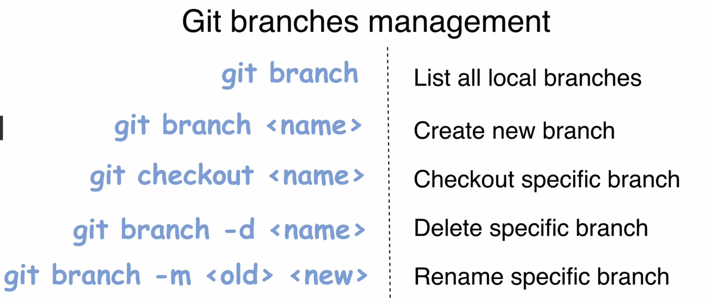

~~~bash
git brangh # List all local branches
git brangh <name> # Create new branch
git checkout <name> # Checkout specific branch

git branch -d <name> # Delete specific branch(only merged branch)
git branch -D <name> # Delete specific branch(non-merged branch also)

git branch -m <old> <new> # Rename specific branch

~~~

~~~bash
git checkout -b <branch name> # Shortcut for creating a branch with checkout
~~~

---

#### Create new branch

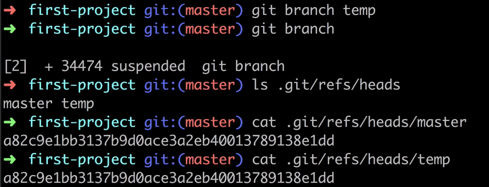

~~~bash
# Create new branch
git branch temp

# check local branchs
git branch
# * main
#   temp

# branch들이 담겨 있음 
ls .git/refs/heads # branch가 가리키는 commit의 hash 담고 있음
# main temp

cat .git/refs/heads/main
cat .git/refs/heads/temp
# 9f5b45d2472cf75141108883f5ee61eced69e4ac
# newly created branch point to the same commit
# 둘이 가리키는 commit이 같음

git checkout temp # Switched to branch 'temp'

cat .git/HEAD # ref: refs/heads/temp

git checkout main

git branch -m temp new-temp

git branch
# * main
#   new-temp

git branch -d new-temp # Deleted branch new-temp (was 9f5b45d).
~~~

---

#### Commit changes in the new branch

~~~bash
git branch # * main

git checkout -b BR-1 # Switched to a new branch 'BR-1'

git branch
# * BR-1
#   main

# HEAD가 new branch를 가리키고 있다.
cat .git/HEAD # ref: refs/heads/BR-1

echo "Hello, Git" > file4.txt

git status # Untracked files: file4.txt

ls # file4.txt

git ls-files -s # 비어있음

git add file4.txt

git ls-files -s
# 100644 b7aec520dec0a7516c18eb4c68b64ae1eb9b5a5e 0	file4.txt

git commit -m "First commit in the BR-1 branch"
# [BR-1 338886a] First commit in the BR-1 branch
~~~

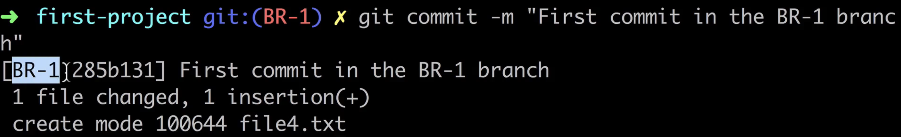

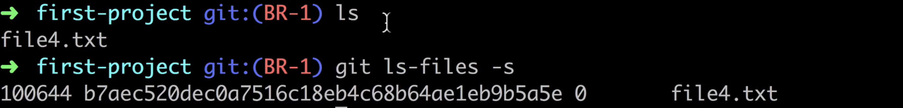

---

#### Explore commit in the new branch

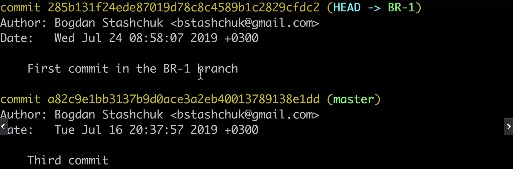

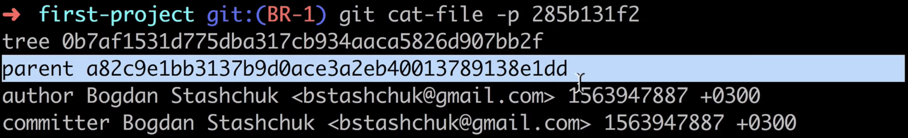

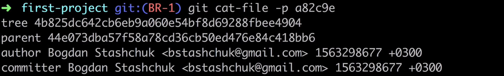

~~~bash
cat .git/HEAD # ref: refs/heads/BR-1
# HEAD는 BR-1 branch, BR-1 branch는 가장 최근 commit을 가리키고 있고 main branch는 그 이전 commit을 가리키고 있다.
~~~

---

#### Git reuses blobs with the same contents

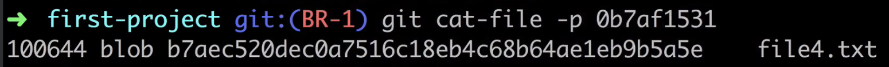

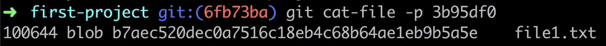

~~~bash
cat .git/HEAD # refs/heads/BR-1
cat .git/refs/heads/BR-1 # 338886

git cat-file -p 338886
# tree 0b7af
# parent 9f5b4

git cat-file -p 0b7af
# 100644 blob b7aec	file4.txt

## b7aec 는 file1.txt의 hash와 동일하다. 이 두 파일은 same contents("Hello, Git")이며 hash가 동일하다. 즉, git은 blobs을 재활용한다. reference이므로 당연한 것이기도..
~~~

- contents가 같다 -> hash가 같다 -> 두 파일의 contents가 같으면 같은 hash를 참고한다
