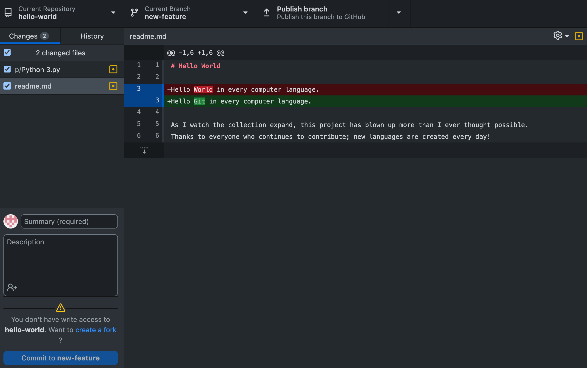
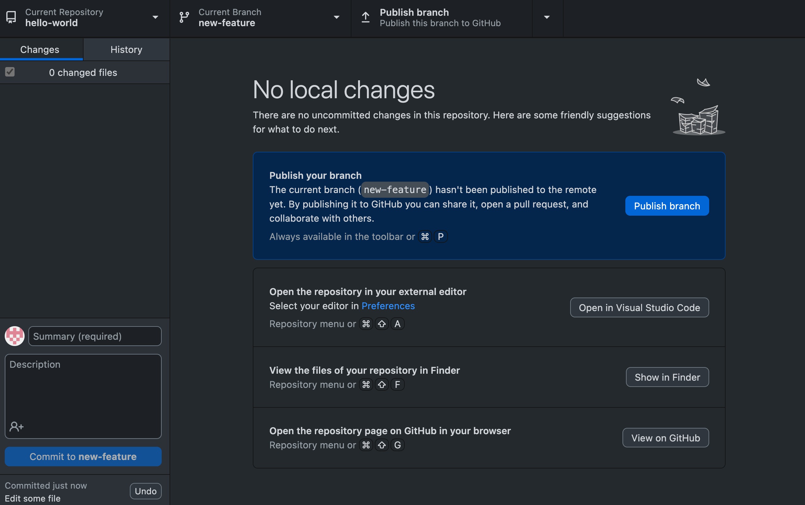
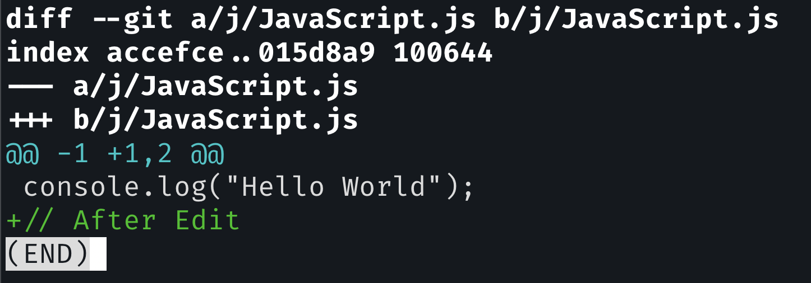
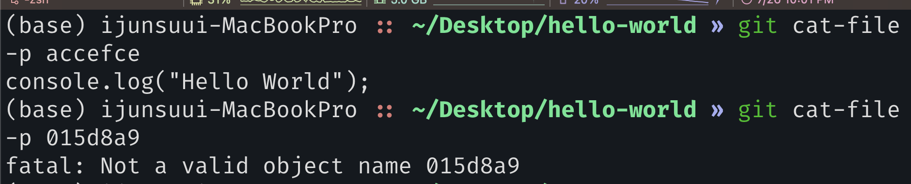
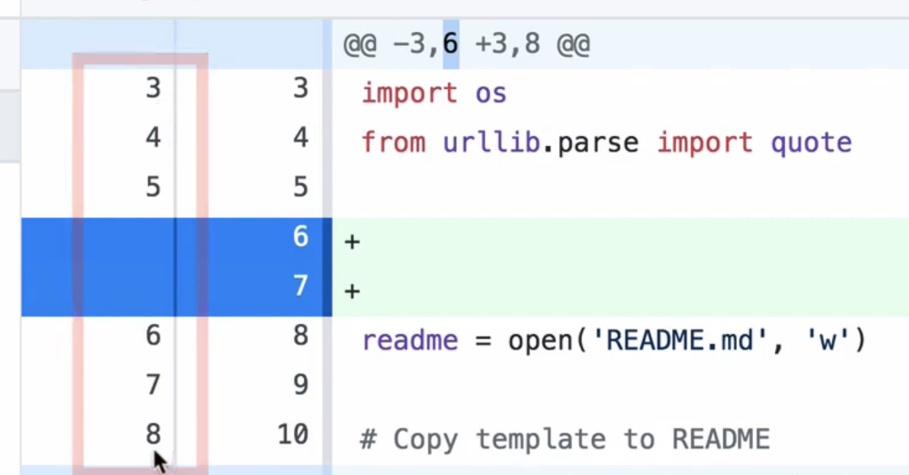
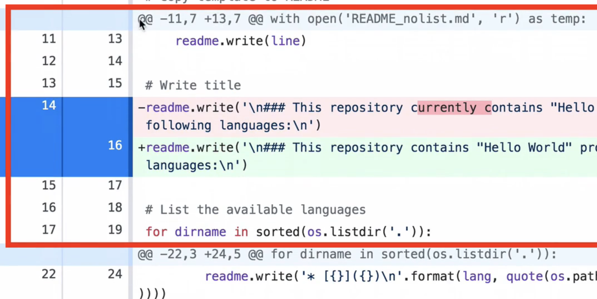

##### Cloning remote repository

GitHub.com/collections/learn-to-code

GitHub.com/leachim6/hello-world

- remote repository를 local 로 가져오는 방법에는 두 가지가 있다. 첫 번째는 Download ZIP, 두 번째는 URL
- 후자의 방법을 사용하여야 Git repository(.git) 를 포함하여 내려받을 수 있다.

~~~bash
git clone <URL>
~~~

##### Exploring contents of the cloned repository

~~~bash
git log

cat .git/HEAD

cat .git/refs/heads/main
# 5e536323618249c28b3da6448d02546001df3acc

git log # merge 된 commit을 찾아라 9de1b

git cat-file -p 9de1b
# tree b63dd
# parent aeb09
# parent 3a4f8
# 부모가 둘이다. merge

git cat-file -p b63dd
~~~

##### Unpacking Git objects

- ~/Desktop/hello-world/.git/objects/pack
  - 이 곳에 packing 되어 있다.
  - <u>.pack file을 pack folder 밖으로 꺼낸다음</u> `git unpack-objects`

~~~bash
# pwd: ~/Desktop/hello-world/.git
cat pack-ec3c6607d5520d1114f74dd90919df18cd07f9cd.pack | git unpack-objects

# cd objects/
# objects 폴더로 이동해보면 엄청 많은 폴더가 생성되어 있다.

# 폴더의 개수가 256개(16 * 16), 16진수로 된 두 개의 문자가 폴더명이 되므로

# pack file은 삭제해주자.
rm -f pack-ec3c6607d5520d1114f74dd90919df18cd07f9cd.pack
~~~

##### Exploring cloned repository in GitHub

- fetch origin: update from a remote repository

##### Installing text Visual Studio Code

git과 연동되어 훨씬 간편하게 작업을 할 수 있다.

##### Commit changes in the cloned repository

~~~bash
# pwd: hello-world
git checkout -b new-feature
# Switched to a new branch 'new-feature'

git branch

# 이후 vim으로 readme.md를 수정하고
# vscode로 다른 파일도 수정
~~~

위를 따르면 다음 상태

~~~bash
git add .

git commit -m "Edit some file"
[new-feature 9f68279]
~~~

 commit을 하면 위 상태처럼 changes가 history에 반영되며 비게 된다.

##### git diff command

~~~bash
# 임의의 파일을 수정한 후
git diff

~~~

~~~bash
git cat-file -p accefce
git cat-file -p 015d8a9
# a file/ b file 은 각각 old file/ new file 인 셈이다.
이전 blobs은 이미 생성되어 저장됐고
이후 blobs은 아직 존재하지 않는다.

modify만 하고 아직 commit하지 않았기 때문

# 100644 는 permission
# @@ -1 +1,2 @@ : start of 
~~~

`git commit -m "Change a j/Javascript.js file"`	

이제 error 가 나왔던 다음 커맨드가 가능해졌다

`git cat-file -p 015d8a9`

즉, 커밋을 함으로써 새로운 blobs들이 생성되었다.

