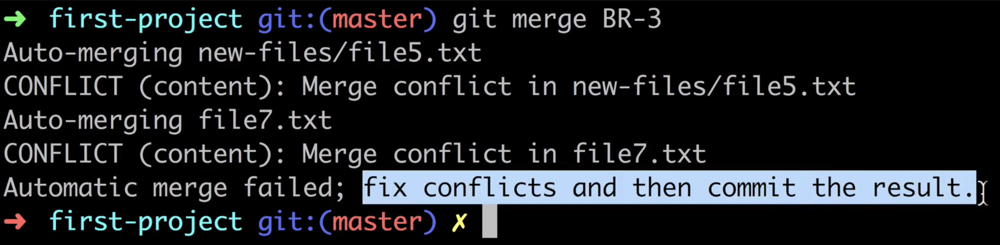

#### Why branches merging is needed

- Merge의 두 가지 방법
  - Fast-forward merge
  - 3-way merge

---

#### Fast forward merge

- Fast forward merge is possible when there are no further commits in the receiving branch after the commit where feature branch was created
- main branch에 분기점 이후 commit이 없어야 한다.
- 새로운 commit을 만드는 것이 아니라 단순히 pointer를 옮기는 방식이다.
- feature1 branch는 필요 없어지면 `git branch -d feature1` 삭제한다.

---

#### Merging process

---

#### Fast forward merge in action

~~~bash
git checkout main

git merge BR-1
~~~

- Updating `a82c9e1`..`285b131`: HEAD가 가르키는 곳이 후자 커밋해쉬(`285b131`)로 바뀌었다.

~~~bash
git branch -d BR-1g
~~~

---

#### 3-way merge

- Create brand new “merge commit”.

- 새로운 commit을 만들어낸다. 그 commit의 부모는 둘이다. 그 commit으로 HEAD를 이동
- feature1 branch는 그대로이며 이 branch에 의한 commit들은 그대로 남아있다.

---

#### Performing 3-way merge

`BR-2` branch

`BR-2` branch

`main` branch

~~~bash
git checkout -b BR-2

# new-files 폴더 생성
    # file5.txt: It is a new file in the new-files folder
    # file6.txt: Another file with filename file6.txt

# file7.txt: Just another file in the root of the working direntory

git commit -m "Three new files were created in the BR-2 branch"

git log

# file5.txt 수정
# msg 추가
# File5.txt was just changed

git status

# automatically stage
commit -a -m "Changed file5.txt"

git checkout main

git log

# file8.txt
# This file was added in the master branch

commit -m "Create file8.txt"

git merge BR-2
~~~

---

#### Observing Git repository after 3-way merge

There are two parents in brand new merged branch

parent1

parent 2

~~~bash
git cat-file -p <HEAD>
# parent가 둘이다.
git branch -d BR-2 # 불필요해진 branch 제거
~~~

---

#### What is Merge confliction

- 언제 발생? Same files were edited in both branches.
- 따라서 fast forward merge에서는 발생하지 않음

---

#### Creating merge conflict

Plan

~~~bash
git branch -b BR-3

# file5.txt 수정하자
# This line was changed in BR-3 branch

# file7.txt 수정하자
# and it was modified in the BR-3 branch as well

git commit -m "Changes made in BR-3 branch"
~~~

~~~bash
git checkout main

# file5.txt 수정하자.
# This line was modifed again in master branch

# file7.txt 수정하자.
# Line replaced in master branch

git commit -m "File7.txt and file5.txt modified in main branch"

git log
~~~

BR-3 branch의 Log

main branch의 log

~~~bash
git merge BR-3

# Merge conflict
# Automatic merged failed;

git status

# GUI로 보면 충돌된 부분을 자세히 확인할 수 있음
~~~

`git merge BR-3` 하면

`git status` 하면

GUI로 확인하면

In VSCode

---

#### Observing conflicts in staging area and working directory

~~~bash
# To list files in staging area
git ls-files -s
~~~

~~~bash
# 0, 1, 2, 3 숫자들은 뭘까? 세 가지 버전이 존재
git cat-file -p <hash>

# 1 # Initial common version of file7.txt
# 2 # file7.txt changed in master branch
# 3 # file7.txt changed in BR-3 branch
~~~

  

~~~bash
cat file7.txt
~~~

---

#### Resolving merge conflict in Terminal

~~~bash
vim file7.txt

# 남길 부분을 제외하고 다 삭제하면 된다.

git add file7.txt
git ls-files -s
# file7에 대한 confliction이 해결됐다(다양한 버전 존재하지 않음, 하나만 존재).
~~~

---

#### Resolving conflicts in VS Code

- vs code 들어가면 여러가지 선택지를 고를 수 있게 활성화 되어 있음
- Accept current change/ Accept incoming change/ Accept both change
- 또는 전부 지우고 새로 작성해도 됨

file5.txt에 대한 conflict를 해결해야 한다.

In vscode - accept incoming change

git commit 후 git log

`git branch -d BR-3`
