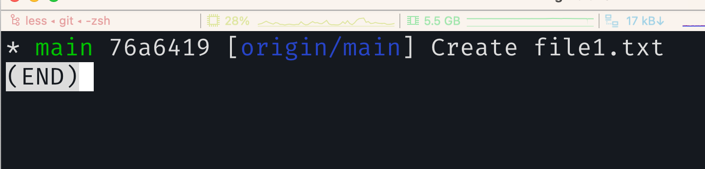
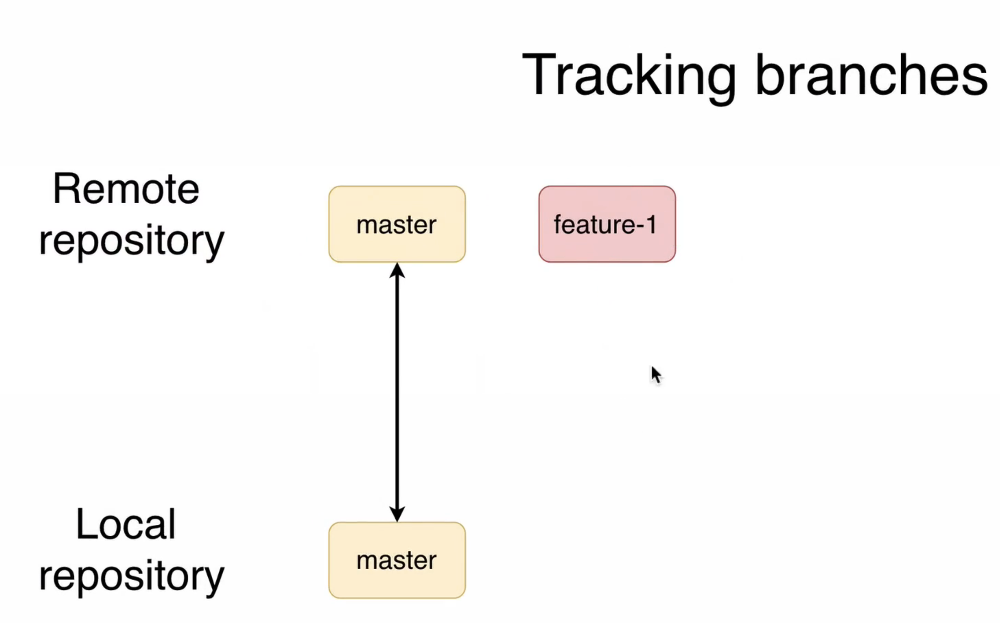
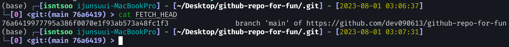
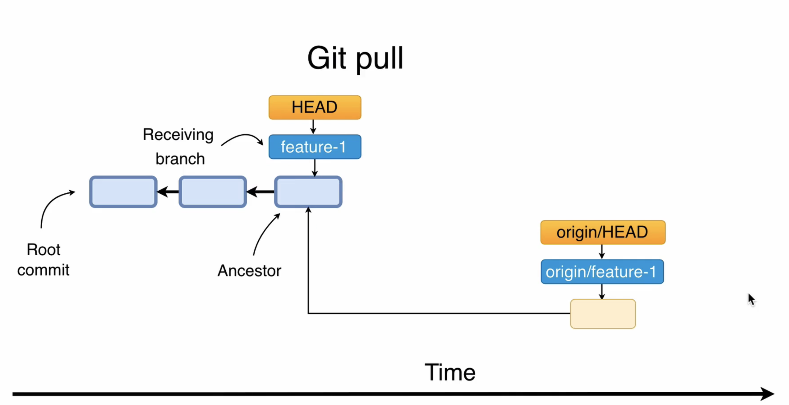

#### Overview of the push fetch and pull Git command

#### What is origin

- Remote repository

~~~bash
# List all remote servers for your local repo
git remote # origin

git remote -v
# origin	https://github.com/dev090613/github-repo-for-fun.git (fetch)
# origin	https://github.com/dev090613/github-repo-for-fun.git (push)

~~~

- By default after cloning, Git will not create corresponding local branches for all remote branches except default remote branch
  - Then, How you can get a list of all remote branches(including local)

#### List remote and local branches

~~~bash
# only remote branch
git branch -r 

# only local branch
git branch 

# all local and remote
git branch -a 
# * main
#   remotes/origin/HEAD -> origin/main
#   remotes/origin/feature-1
#   remotes/origin/main

~~~

#### What is tracking branch

~~~bash
git branch -vv 
# local branch에 대한 추가정보를 알 수 있다.
# 예를 들면, 현재 브랜치와 연결된 원격 추적 브랜치
~~~

#### Checkout remote branch

현 상태

~~~bash
git branch -a

git checkout feature-1
~~~

현 상태

~~~bash
git branch -d feature-1
# error: Cannot delete branch 'feature-1' checked out at '/Users/isntsoo/Desktop/github-repo-for-fun'
git checkout main

git branch
#   feature-1
# * main

git branch -d feature-1
~~~

- local에서 삭제되었다. 그래도 remote에는 남아있다. `git remote -a`로 확인

- 다음 단계 진행을 위해 local에 다시 remote의 feature-1을 트랙킹하는 feature-1 branch를 만들자 `git checkout feature-1`,  `git branch -vv`

#### Git remote show origin

- 다음 command는 local, remote 에 관한 Entire information을 얻을 수 있다.

~~~bash
# git remote show <nameofServer>
git remote show origin
~~~

#### Git fetch in action

~~~bash
# web으로 temp branch 생성한 다음,

git branch -r # 로컬저장소에 있는 원격 브랜치들을 보여주므로,
# 원격저장소와 아직 동기화 되지 않았으므로 temp branch가 나타나지 않음

git fetch # temp branch를 remote에서 local로 가져왔다.
# 원격 저장소의 최신 정보를 로컬 저장소로 가져옴.

git branch -r
~~~

~~~bash
# local에 temp에 대한 Tracking branch를 만들자
git checkout temp

git brangh -vv

git remote show origin
~~~

~~~bash
# Web(원격)에서 temp branch를 제거한 다음,

git remote show

git remote prune origin

git branch -vv

git checkout main

git branch -d temp
~~~

#### Git pull is 2-step precess

#### How to perform git pull

현 상황

  

- Your local branch is receiving branch

#### What is FETCH_HEAD

~~~bash
git fetch -v
git pull -v

git checkout main

git pull -v

cd .git
cat FETCH_HEAD

~~~

- After fetching it will update .git/FETCH_HEAD list and first branch in this list will be currently checked out branch
- Finally Git executes "git merge FETCH_HEAD" command that finds first branch in .git/FETC H_HEAD list without "not-for-merge" tag and merge it into local tracking currently checked out branch

#### Git pull with fast forward merge

~~~bash
# Web으로 가서
# feature-1 branch 위치
# feature/another-file.txt 생성
# Just another file created in the feature-1 branch
# commit

# local로 가져오자
git checkout feature-1
git pull -v 
~~~

#### Fetch remote changes manually

~~~bash
git checkout feature-1

# another-file.txt 수정
# This file was modiried locally 추가
# commit -m "Modified another-file.txt locally"

# Web으로 가서
# feature/one-more-file.txt 생성
# This file was created in the remote repository 추가

git fetch -v

git ls-files -s # merge 안했으니 아직 새로 추가했던 파일은 등장 안함 
# .git/objects에는 있다.

~~~

- .git/objects/ 에 blob은 생성이 된 상태

다만 아직 working directory와 staging area에 존재하지 않는 상태

ㄴ 이렇게 git repo에는 생성이 되어 있음을 확인했다.

#### Merge FETCH_HEAD manually

~~~bash
cat .git/FETCH_HEAD

git log

~~~

#### Resolving conflicts during Git pull

~~~bash
# remote repo에서 작업을 해보자
# feature-1 branch에서 readme.md 수정
# one more edit at Github 추가
# commit

# 이번엔 local repo에서 작업을 한다.
# terminal, feature-1 branch
# vim readme.md
# This file was modified locally 추가
# commit -a -m "Modified REAME.md file locally"

git pull -v # Confliction

git ls-files -s # 3개 version의 file, 하나씩 확인해보자
# git repo에 blobs는 생성됐지만 git ls-files -s 에는 하나의 readme.md가 나타난다.
# 버전업 된 것 같다.

vim README.md # 새로운 버전으로 수정
# This line was modified manually during conflicts resolution

git commit -a 
~~~

git pull이 아니라 git merge FETCH_HEAD 하니까 세 버전의 README.md가 나타났다.

git pull은 blob만 생겼었는데.. 아마 뭔가 git pull에 업데이트가 있는게 아닐까

아무튼, 이번 기회에 git pull이 git fetch와 git merge FETCH_HEAD 라는 것을 확실히 이해했다.

#### Pushing to remote repository

~~~bash
git remote -v

# 이제 local repo의 변화를 remote repo로 올려본다. git push

git push -v # 다른 author, email로 push 가능하다.

cat .git/config
~~~

해결! 최초 remote repo를 clone 할 때 https 방식으로 했었는데, Github는 ssh 방식의 읽고 쓰기만을 지원하는 것 같다.

이를 수정해줬다.

`git log` : remote repo(origin) 의 포인터가 이동했다.

#### Commit under another author

~~~bash
# readme.md 수정
# New line was added locally
git commit -m "Another local change"

git push -v

# Local repository user.name and user.email settings override global Git settings
# 즉, local 환경의 user.name, user.email을 수정해서 push하면 된다.
~~~

#### Remote and local branches are in sync

주기적으로 `git fetch`를 해서 remote repo와 싱크를 맞춰주자

GUI를 쓰면 간단하다

`git pull -v`

`git push -v`

하였을 때 up to date 이면 된다.

#### Create remote branch based on local

~~~bash
git checkout -b feature-2

git branch -r # remote repo에는 없는 것 확인

git branch -vv # remote repo에는 없는 것 확인

# feature/another-file.txt 수정
# This line was added in teature-2 branch 추가
# 첫 줄 : This line was replace in feature-2 branch 교체
# commit -m "Another-file.txt was modified in feature-2 branch"

git push -v # Error! ### 가 나오지 않았다.
# 깃허브가 업데이트 된 것 같다.

# git push --set-upstream origin feature-2
# 축약해서 이렇게 가능
git push -v -u origin feature-2

git branch -vv

# 다시 수정
# Another modification in the feature-2 branch

git push -v # No need to specify name of the server and
# name of the remote branch because local "feature-2" branch is
# already tracking branch and know its remote branch
~~~

실제로 해보니 git push -v 만으로 remote repo에 tracking branch가 없음에도 branch가 생성되면서

push가 그냥 됐다.

#### Update tracking statuses of the branches

~~~bash
# remote
# temp branch 생성 in feature-2 branch

# local
git branch # temp 없음
git fetch
git branch # temp 여전히 없음
git branch -vv # temp 여전히 없음, -a로는 확인 가능
git branch -a

git checkout temp
git branch -vv # 이제 temp가 local에도 생성됐음

# remote
# delete temp
git fetch # no temp branch
git branch -vv # 여전히 있음...
# 왜 반영이 안될까? 반영되게 하려면?
git remote update origin
git remote update origin --prune # 이것.
git branch -vv

git checkout main
git branch -d temp # 삭제 불가
git branch -D temp
~~~

#### Remove remote branch using local

~~~bash
# local
git checkout -b temp

git push -u -origin temp
~~~

~~~bash
# local 환경에서 remote repo의 temp branch를 지워본다.
git push origin -d temp
~~~

   

~~~bash
# local에서도 지우자
git checkout main
git branch -d temp
~~~

#### Git show-ref

`git show-ref` : 특정 branch의 local과 remote의 reference를 빠르게 비교하고 싶다면.

~~~bash
git show-ref

ls .git/refs/heads

ls .git/refs/remotes/origin
~~~

~~~bash
git show-ref main
git show-ref feature-2
# 같은 hash를 가리키고 있는지 등을 볼 수 있음
~~~

~~~bash
git  checkout feature-2

# readme.md 수정
# Edit in the feature-2 branch
# commit -m "Changes in feature-2"

git show-ref feature-2
git log
~~~

`git push-v`

