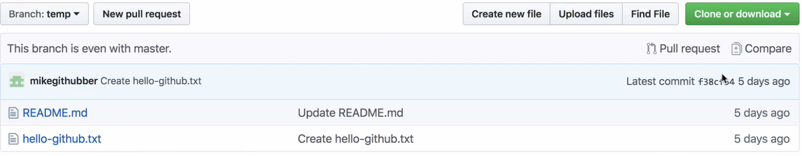
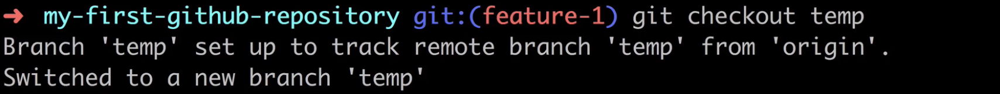
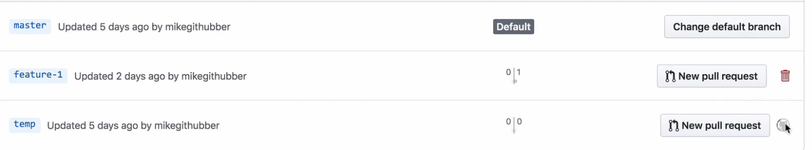
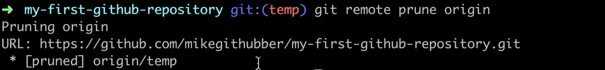
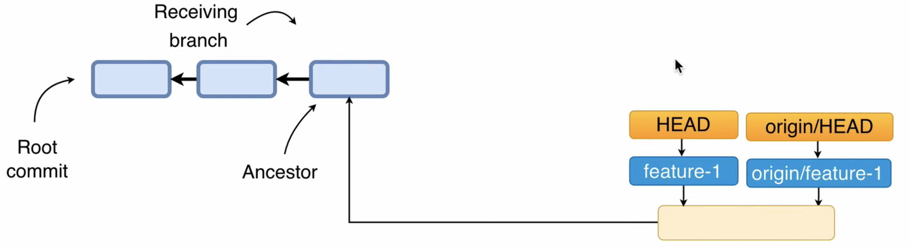
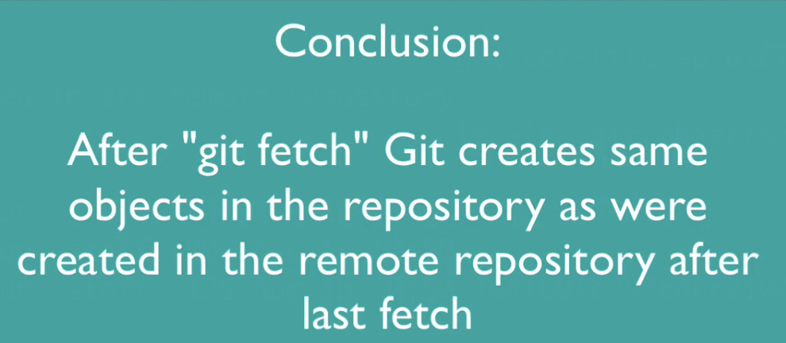
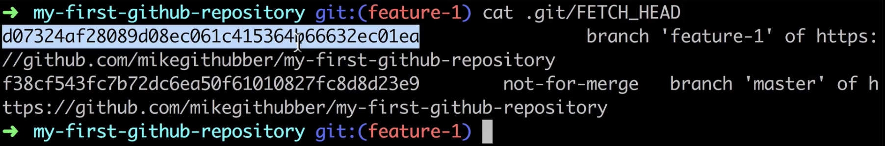
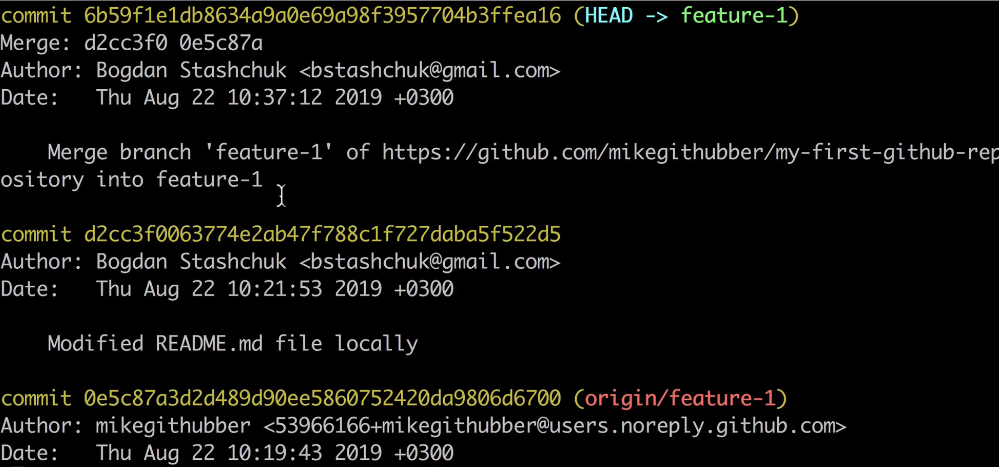
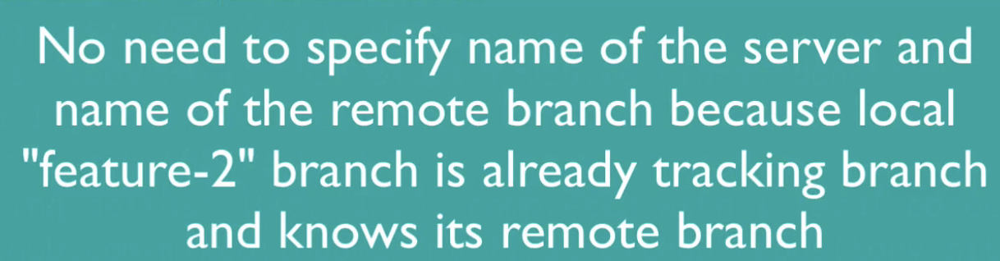
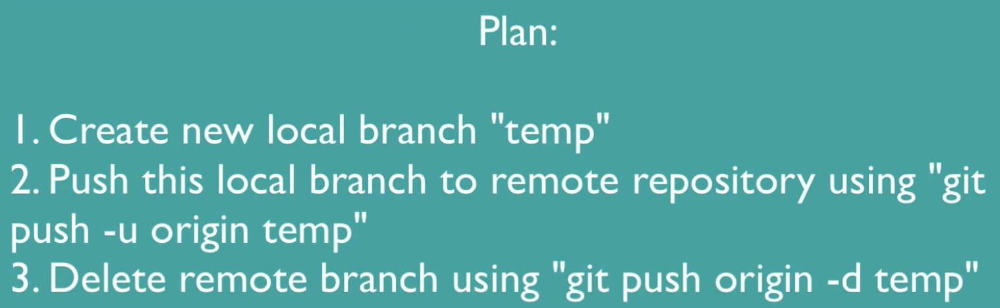

#### Overview of the push fetch and pull Git command

- Does remote repository update itself automatically after local repository change? <u>No you need to push changes</u>.
- What happens when remote repository updates? Does local repository update itself automatically? <u>No, you need to pull changes.</u>

---

#### About `fetch`

- `git fetch` command doesn’t update your `local working directory`. 

cf> `pull`

---

#### What is origin

- default name of remote repository is `origin`.

- `git remote`: you are able to list all remote servers for your local git repositories.

By default after cloning, Git will not create corresponding local branches for all remote branches except default remote branch

- Question 🙋‍♂️ : How you can get a list of all remote branches(including local)?? coming soon...
  - List all branches available locally and on remote server: `git branch -a`

---

#### List remote and local branches

~~~bash
# all local and remote
git branch -a 
# * main
#   remotes/origin/HEAD -> origin/main
#   remotes/origin/feature-1
#   remotes/origin/main

# only remote branch
git branch -r 

# only local branch
git branch  
~~~

---

#### What is tracking branch

- Tracking branch is your local branch that is connected to specific remote branch.
  - `master`, `release`, `BR-2`
- By default, when you clone any remote repository, git create only one tracking branch with the same name as default branch in the remote repository.

~~~bash
git branch -vv 
# local branch에 대한 추가정보를 알 수 있다.
# 예를 들면, 현재 브랜치와 연결된 원격 추적 브랜치(tracking branch)
~~~

remote repository

---

#### Checkout remote branch

`git branch -a`

Let’s create another local tracking branch for remote feature(`feature-1`)

`git checkout feature-1`

`git branch`

현 상태

~~~bash
git branch -d feature-1
# error: Cannot delete branch 'feature-1' checked out at '/Users/isntsoo/Desktop/github-repo-for-fun'
git checkout main

git branch
#   feature-1
# * main

git branch -d feature-1
~~~

- local에서 삭제되었다. 그래도 remote에는 남아있다. `git remote -a`로 확인

- 다음 단계 진행을 위해 local에 다시 remote의 feature-1을 트랙킹하는 feature-1 branch를 만들자 `git checkout feature-1`,  `git branch -vv`

---

#### Git remote show origin

`git branch -vv`

- 다음 command는 local, remote 에 관한 Entire information을 얻을 수 있다.

~~~bash
# git remote show <nameofServer>
git remote show origin
~~~

---

#### Git fetch in action

일단 web 상에서 새로운 branch named `temp`를 생성한 후,

In local, `git branch -r` - (로컬저장소에 있는 원격 브랜치들을 보여주므로, 원격저장소와 아직 동기화 되지 않았으므로 temp branch가 나타나지 않음)

`git fetch` - (temp branch를 remote에서 local로 가져왔다. 원격 저장소의 최신 정보를 로컬 저장소로 가져옴.) (`fetch` command: You will be able to fetch remote changes and download them into your local git repository.)

다시 한 번 `git branch -r`

~~~bash
# local에 temp branch에 대한 Tracking branch를 만들자
~~~

`git checkout temp`

`git brangh -vv`

`git remote show origin`

~~~bash
# Web(원격)에서 remote server의 temp branch를 제거한 다음,
git checkout main

git branch -d temp
~~~

`git remote prune origin`

`git branch -vv`

`git branch -vv`

`git branch -d temp`

`git branch -vv`

`git remote show origin`

---

#### Git pull is 2-step precess

- Git Pull consists of Git Fetch and Git Merge. It is two-steps process.
- Git pull updates only single local currently checked out branch

---

#### How to perform git pull

현 상황

  

- Your local branch is receiving branch to pull. 

---

#### What is FETCH_HEAD

~~~bash
git fetch -v
git pull -v

git checkout main

git pull -v

cd .git
cat FETCH_HEAD

~~~

`git branch -a`

`git branch -vv`

`git remote show origin`

`git fetch -v`, and `git pull -v`

- 위 그림으로 `git pull`에서는 `git fetch`가 선행됨을 알 수 있다.

`cat FETCH_HEAD `

In remote server

- After fetching it will update .git/FETCH_HEAD list and first branch in this list will be currently checked out branch
- Finally Git executes "git merge FETCH_HEAD" command that finds first branch in .git/FETC H_HEAD list without "not-for-merge" tag and merge it into local tracking currently checked out branch

---

#### Git pull with fast forward merge

remote repository에서 새로운 commit을 한다 in feature-1 branch

In feature-1 branch(receiving branch)

check staging area

merge 전

merge 후

---

#### Fetch remote changes manually

Modified in local, `feature-1` branch, and commit

In remote repository, `feature-1` branch, create another file. and commit

`git fetch -v`

`git ls-files -s`

---

#### Merge FETCH_HEAD manually

In remote server

But In local,

- 아직 merge를 하지 않았기 때문에 log에 d0732가 log에 표시되지 않음.

`git merge FETCH_HEAD`... 3 ways merge 이루어짐.

`ls -la feature`

`git ls-files -s`

`git pull`: 당해 커맨드 입력 없이, fetch와 merge로 pull은 이미 완료가 됐다

`git log`, new merge commit을 확인해볼 수 있다.) (hash of merge 확인해보기)

new merge commit 확인

현 상황: 다음 그림과 같다

---

#### Resolving conflicts during Git pull

현 상황

In remote, edit README.md. and commit(`0e5c8`).

In local, edit README.md. and commit(`d2cc3f0`)(To make conflict)

`git pull -v` : CONFLICT 발생(In `feature-1` branch)

In vscode

In staging area

Conflict 해결하자 on README.md file

`commit`

`git log`

아직 push를 하지 않았으므로, remote repository는 다음과 같다.

---

#### Pushing to remote repository 

`git push` 전에 `pull`을 먼저 해주자.

- 현재 상황: There are changes in the local repository that are absent in the remote repository.

- In order to perform git push operation, you need to have write access to remote repository.

`git push -v`

`git log`

> `git pull`에 관한 유익한 글
>
> https://ryanking13.github.io/2021/10/17/why-git-pull-is-broken.html

---

#### Commit under another author

In local, modify README.md. and commit

`git log`

---

#### Remote and local branches are in sync

주기적으로 `git fetch`를 해서 remote repo와 싱크를 맞춰주자

GUI를 쓰면 간단하다

`git pull -v`

`git push -v`

하였을 때 up to date 이면 된다.

---

#### Create remote branch based on local

`git checkout -b feature-2`

`git branch -vv`

In local, feature-2 branch, modify another-file.txt. and commit.

git log

`git push -v` : error 발생

`git push --set-upstream origin feature-2`

`git branch -vv`

In vs code, another modification. and commit.

`git push -v`

`git log`

---

#### Update tracking statuses of the branches

In Remote, create new branch `temp`

`git fetch`

`git branch -a`

`git checkout temp`

`git branch -a`

`git branch -vv`

In remote, delete `temp` branch

`git fetch`

`git branch -vv`: 

- remote temp branch가 삭제됐음에도 여기에는 나타난다. 즉 local temp branch는 여전히 remote temp branch를 tracking하고 있다.

`git remote update origin --prune`

`git branch -vv`

`git checkout main`

`git branch -D temp`

`git branch -vv`

---

#### Remove remote branch using local

`git checkout -b temp`, `git branch -a`

`git push -u origin temp`

`git branch -vv`

`git push origin -d temp`

local 환경에서 remote repo의 temp branch를 지워보자

`git branch -a`

`git checkout main`, `git branch -D temp`

   

---

#### Git show-ref

`git show-ref` : 특정 branch의 local과 remote의 reference를 빠르게 비교하고 싶다면.

`git show-ref`

다른 방법(수고스러움)

branch 별로도 확인할 수 있음. hash도 비교 가능.

`git checkout featrue-2`. and modify README.md file.

- 둘의 hash가 달라졌다.

`git log`

`git push -v`

`git show-ref feature-2`

- 다시 같아졌다.