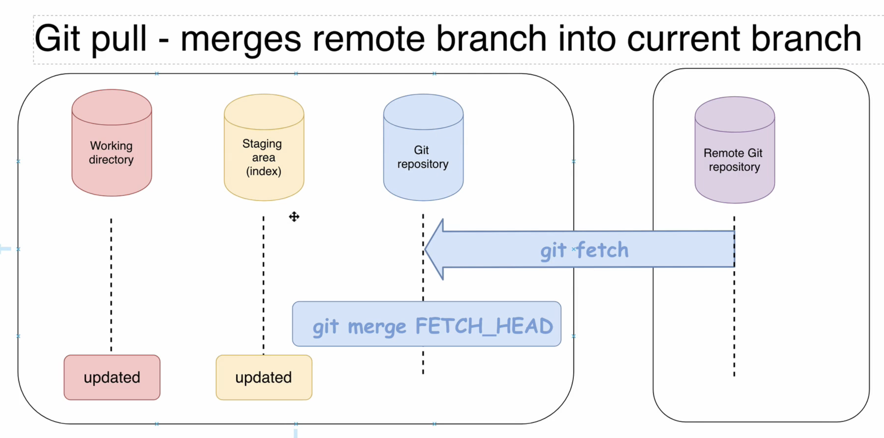
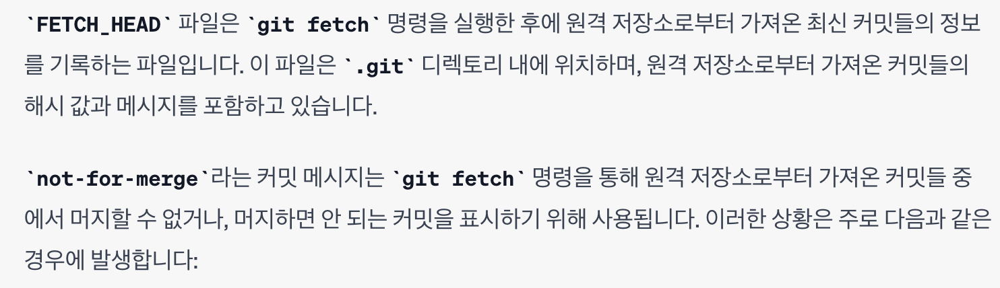
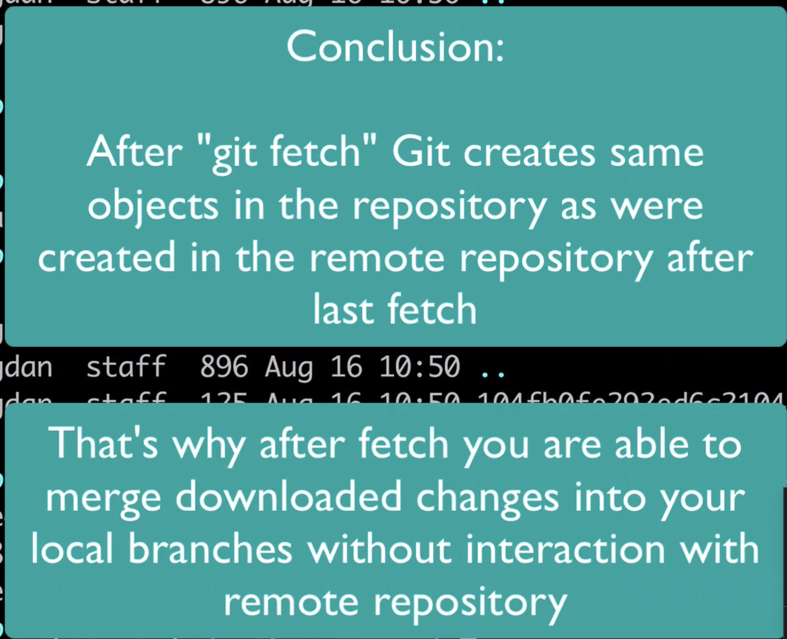

#### Overview of the push fetch and pull Git command

- Does remote repository update itself automatically after local repository change? <u>No you need to push changes</u>.
- What happens when remote repository updates? Does local repository update itself automatically? <u>No, you need to pull changes.</u>

---

#### About `fetch`

- `git fetch` command doesn’t update your `local working directory`. 

cf> `pull`

---

#### What is origin

- default name of remote repository is `origin`.

- `git remote`: you are able to list all remote servers for your local git repositories.

By default after cloning, Git will not create corresponding local branches for all remote branches except default remote branch

- Question 🙋‍♂️ : How you can get a list of all remote branches(including local)?? coming soon...
  - List all branches available locally and on remote server: `git branch -a`

---

#### List remote and local branches

~~~bash
# all local and remote
git branch -a 
# * main
#   remotes/origin/HEAD -> origin/main
#   remotes/origin/feature-1
#   remotes/origin/main

# only remote branch
git branch -r 

# only local branch
git branch  
~~~

---

#### What is tracking branch

- Tracking branch is your local branch that is connected to specific remote branch.
  - `master`, `release`, `BR-2`
- By default, when you clone any remote repository, git create only one tracking branch with the same name as default branch in the remote repository.

~~~bash
git branch -vv 
# local branch에 대한 추가정보를 알 수 있다.
# 예를 들면, 현재 브랜치와 연결된 원격 추적 브랜치(tracking branch)
~~~

remote repository

---

#### Checkout remote branch

~~~bash
git branch -a

git checkout feature-1
~~~

`git branch -a`

Let’s create another local tracking branch for remote feature(`feature-1`)

현 상태

~~~bash
git branch -d feature-1
# error: Cannot delete branch 'feature-1' checked out at '/Users/isntsoo/Desktop/github-repo-for-fun'
git checkout main

git branch
#   feature-1
# * main

git branch -d feature-1
~~~

- local에서 삭제되었다. 그래도 remote에는 남아있다. `git remote -a`로 확인

- 다음 단계 진행을 위해 local에 다시 remote의 feature-1을 트랙킹하는 feature-1 branch를 만들자 `git checkout feature-1`,  `git branch -vv`

#### Git remote show origin

- 다음 command는 local, remote 에 관한 Entire information을 얻을 수 있다.

~~~bash
# git remote show <nameofServer>
git remote show origin
~~~

#### Git fetch in action

~~~bash
# web으로 temp branch 생성한 다음,

git branch -r # 로컬저장소에 있는 원격 브랜치들을 보여주므로,
# 원격저장소와 아직 동기화 되지 않았으므로 temp branch가 나타나지 않음

git fetch # temp branch를 remote에서 local로 가져왔다.
# 원격 저장소의 최신 정보를 로컬 저장소로 가져옴.

git branch -r
~~~

~~~bash
# local에 temp에 대한 Tracking branch를 만들자
git checkout temp

git brangh -vv

git remote show origin
~~~

~~~bash
# Web(원격)에서 temp branch를 제거한 다음,

git remote show

git remote prune origin

git branch -vv

git checkout main

git branch -d temp
~~~

#### Git pull is 2-step precess

#### How to perform git pull

현 상황

  

- Your local branch is receiving branch

#### What is FETCH_HEAD

~~~bash
git fetch -v
git pull -v

git checkout main

git pull -v

cd .git
cat FETCH_HEAD

~~~

- After fetching it will update .git/FETCH_HEAD list and first branch in this list will be currently checked out branch
- Finally Git executes "git merge FETCH_HEAD" command that finds first branch in .git/FETC H_HEAD list without "not-for-merge" tag and merge it into local tracking currently checked out branch

#### Git pull with fast forward merge

~~~bash
# Web으로 가서
# feature-1 branch 위치
# feature/another-file.txt 생성
# Just another file created in the feature-1 branch
# commit

# local로 가져오자
git checkout feature-1
git pull -v 
~~~

#### Fetch remote changes manually

~~~bash
git checkout feature-1

# another-file.txt 수정
# This file was modiried locally 추가
# commit -m "Modified another-file.txt locally"

# Web으로 가서
# feature/one-more-file.txt 생성
# This file was created in the remote repository 추가

git fetch -v

git ls-files -s # merge 안했으니 아직 새로 추가했던 파일은 등장 안함 
# .git/objects에는 있다.

~~~

- .git/objects/ 에 blob은 생성이 된 상태

다만 아직 working directory와 staging area에 존재하지 않는 상태

ㄴ 이렇게 git repo에는 생성이 되어 있음을 확인했다.

#### Merge FETCH_HEAD manually

~~~bash
cat .git/FETCH_HEAD

git log

~~~

#### Resolving conflicts during Git pull

~~~bash
# remote repo에서 작업을 해보자
# feature-1 branch에서 readme.md 수정
# one more edit at Github 추가
# commit

# 이번엔 local repo에서 작업을 한다.
# terminal, feature-1 branch
# vim readme.md
# This file was modified locally 추가
# commit -a -m "Modified REAME.md file locally"

git pull -v # Confliction

git ls-files -s # 3개 version의 file, 하나씩 확인해보자
# git repo에 blobs는 생성됐지만 git ls-files -s 에는 하나의 readme.md가 나타난다.
# 버전업 된 것 같다.

vim README.md # 새로운 버전으로 수정
# This line was modified manually during conflicts resolution

git commit -a 
~~~

git pull이 아니라 git merge FETCH_HEAD 하니까 세 버전의 README.md가 나타났다.

git pull은 blob만 생겼었는데.. 아마 뭔가 git pull에 업데이트가 있는게 아닐까

아무튼, 이번 기회에 git pull이 git fetch와 git merge FETCH_HEAD 라는 것을 확실히 이해했다.

#### Pushing to remote repository

~~~bash
git remote -v

# 이제 local repo의 변화를 remote repo로 올려본다. git push

git push -v # 다른 author, email로 push 가능하다.

cat .git/config
~~~

해결! 최초 remote repo를 clone 할 때 https 방식으로 했었는데, Github는 ssh 방식의 읽고 쓰기만을 지원하는 것 같다.

이를 수정해줬다.

`git log` : remote repo(origin) 의 포인터가 이동했다.

#### Commit under another author

~~~bash
# readme.md 수정
# New line was added locally
git commit -m "Another local change"

git push -v

# Local repository user.name and user.email settings override global Git settings
# 즉, local 환경의 user.name, user.email을 수정해서 push하면 된다.
~~~

#### Remote and local branches are in sync

주기적으로 `git fetch`를 해서 remote repo와 싱크를 맞춰주자

GUI를 쓰면 간단하다

`git pull -v`

`git push -v`

하였을 때 up to date 이면 된다.

#### Create remote branch based on local

~~~bash
git checkout -b feature-2

git branch -r # remote repo에는 없는 것 확인

git branch -vv # remote repo에는 없는 것 확인

# feature/another-file.txt 수정
# This line was added in teature-2 branch 추가
# 첫 줄 : This line was replace in feature-2 branch 교체
# commit -m "Another-file.txt was modified in feature-2 branch"

git push -v # Error! ### 가 나오지 않았다.
# 깃허브가 업데이트 된 것 같다.

# git push --set-upstream origin feature-2
# 축약해서 이렇게 가능
git push -v -u origin feature-2

git branch -vv

# 다시 수정
# Another modification in the feature-2 branch

git push -v # No need to specify name of the server and
# name of the remote branch because local "feature-2" branch is
# already tracking branch and know its remote branch
~~~

실제로 해보니 git push -v 만으로 remote repo에 tracking branch가 없음에도 branch가 생성되면서

push가 그냥 됐다.

#### Update tracking statuses of the branches

~~~bash
# remote
# temp branch 생성 in feature-2 branch

# local
git branch # temp 없음
git fetch
git branch # temp 여전히 없음
git branch -vv # temp 여전히 없음, -a로는 확인 가능
git branch -a

git checkout temp
git branch -vv # 이제 temp가 local에도 생성됐음

# remote
# delete temp
git fetch # no temp branch
git branch -vv # 여전히 있음...
# 왜 반영이 안될까? 반영되게 하려면?
git remote update origin
git remote update origin --prune # 이것.
git branch -vv

git checkout main
git branch -d temp # 삭제 불가
git branch -D temp
~~~

#### Remove remote branch using local

~~~bash
# local
git checkout -b temp

git push -u -origin temp
~~~

~~~bash
# local 환경에서 remote repo의 temp branch를 지워본다.
git push origin -d temp
~~~

   

~~~bash
# local에서도 지우자
git checkout main
git branch -d temp
~~~

#### Git show-ref

`git show-ref` : 특정 branch의 local과 remote의 reference를 빠르게 비교하고 싶다면.

~~~bash
git show-ref

ls .git/refs/heads

ls .git/refs/remotes/origin
~~~

~~~bash
git show-ref main
git show-ref feature-2
# 같은 hash를 가리키고 있는지 등을 볼 수 있음
~~~

~~~bash
git  checkout feature-2

# readme.md 수정
# Edit in the feature-2 branch
# commit -m "Changes in feature-2"

git show-ref feature-2
git log
~~~

`git push-v`

