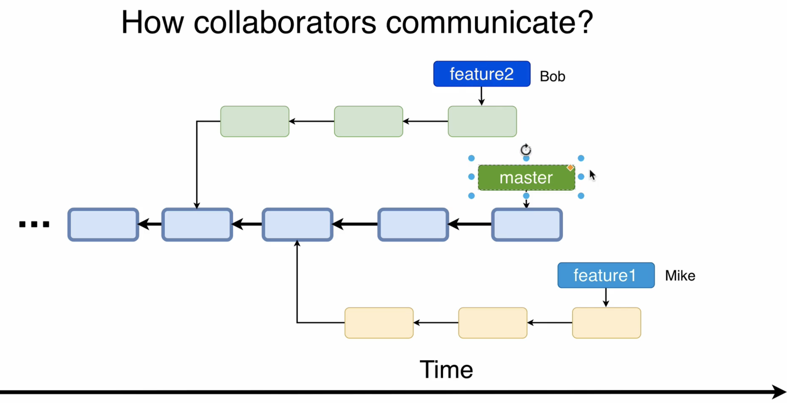
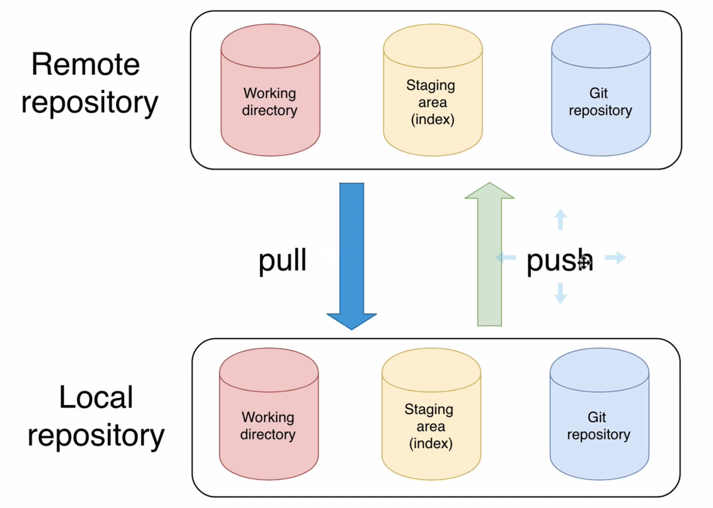
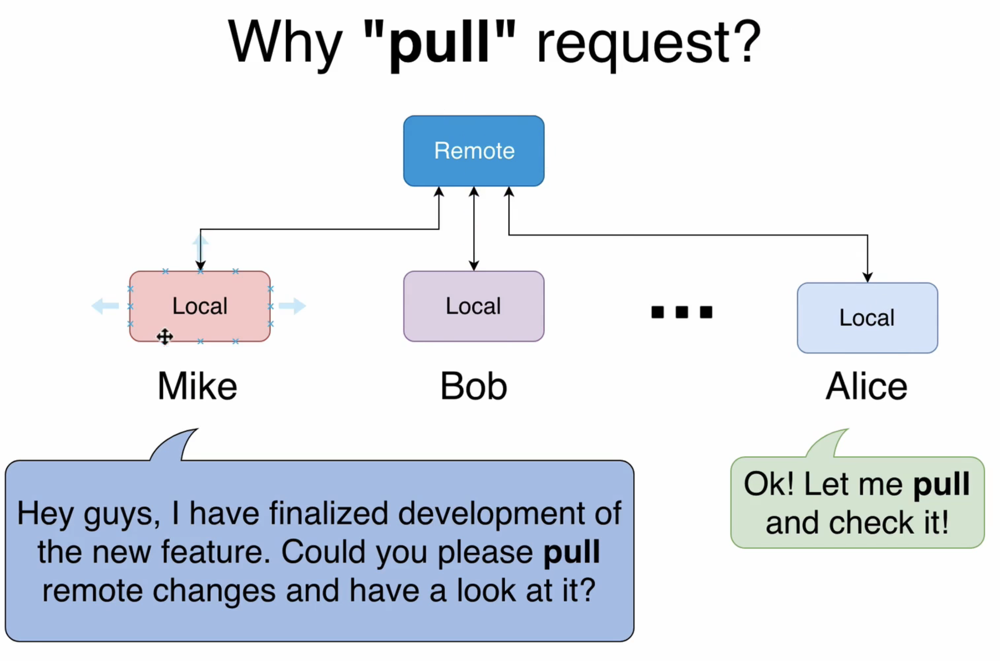

#### What is pull request?

- 여러 명의 개발자들이 서로 분기점에서 서로 다른 기능들을 개발한다.
- Pull request is a proposal of the potential changes

#### Why pull request was named pull request?

- pull request != git pull

